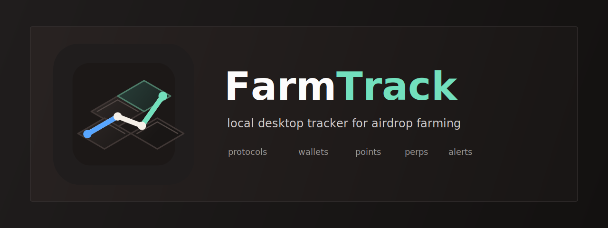

# FarmTrack

[English](README.md) | [Русский](README.ru.md)



A local desktop app for tracking crypto airdrop farming — protocols, wallets, balances, P&L, and perp positions. Built with Python + Flask + pywebview. No cloud, no accounts, everything stays on your machine.


---

## Demo

<video src="marketing/github-demo-video/farmtrack-github-demo.mp4" controls width="100%"></video>

[Watch the 30-second demo](marketing/github-demo-video/farmtrack-github-demo.mp4)

---

## Screenshots

Screenshots below use sanitized demo data.


<p>
  
  
</p>

<p>
  
  
</p>

---

## Features

- **Profiles** — separate databases for different sets of wallets, switch between them instantly
- **Protocols** — track every project: deposit, balance, spent, withdrawn, points, $/point, status
- **Weekly snapshots** — break protocol data into weeks, track progress over time
- **Wallets** — manage addresses across protocols, add labels, bulk import from spreadsheets
- **Import** — paste wallet data from Google Sheets into any protocol or weekly snapshot
- **Export** — export all data to Excel in one click
- **Perp** — live positions from HyperLiquid, Nado, Extended, Pacifica; grouped by account with P&L, Margin Ratio and Account Leverage badges per account
- **Telegram bot** — liquidation alerts and periodic position reports sent to Telegram; supports `/report` and `/danger` commands from the chat
- **Overview** — total balance, spent, net profit, $/point across all protocols at a glance
- **Light/dark theme** — toggle in the sidebar, persists between sessions

---

## Download

Pre-built binaries are available in [Actions → latest build → Artifacts](../../actions):

- **FarmTrack-Windows** — unzip, run `FarmTrack.exe`
- **FarmTrack-Mac** — unzip, run `FarmTrack.app` (right-click → Open on first launch)

No Python required.

---

## Run from source

### 1. Clone

```bash
git clone https://github.com/DontFoldBB/farmtrack.git
cd farmtrack
```

### 2. Install dependencies

```bash
pip install -r requirements.txt
```

### 3. Run

```bash
python main.py
```

The app opens as a native desktop window. On first launch, create a profile to get started.

---

## Stack

| Layer | Tech |
|---|---|
| Backend | Python 3.10+, Flask |
| Frontend | Vanilla JS + HTML/CSS (OpenCode design system, light + dark) |
| Desktop | pywebview (native window, no browser needed) |
| Database | SQLite (one `.db` file per profile) |
| Export | openpyxl |
| Tests | pytest (255 tests) |

---

## Project Structure

```
farmtrack/
├── main.py           # Entry point — starts Flask + opens webview window
├── app.py            # Flask routes / REST API
├── database.py       # SQLite logic, all DB operations
├── telegram_bot.py   # Telegram bot — alerts, reports, command polling
├── requirements.txt  # Python dependencies
├── tests/
│   ├── test_database.py    # DB operations (191 tests)
│   ├── test_app.py         # Flask routes
│   └── test_migrations.py # Schema migration safety
└── templates/
    ├── index.html    # Main app UI (single-page)
    └── profiles.html # Profile selection screen
```

Data is stored in `data/<profile-name>.db` — created automatically, not tracked by git.

---

## Running tests

```bash
pytest tests/
```

Each test gets its own isolated in-memory database — no shared state, no manual cleanup. Migration tests verify that existing rows survive schema upgrades.

---

## Usage Guide

### 1. Create a profile
On first launch you'll see the profile screen. Create a profile — each profile gets its own isolated database. Switch between profiles anytime via **Switch Profile** in the sidebar.

### 2. Add protocols
Go to **Protocols** and add each project you're farming. Fill in deposit, balance, spent, withdrawn, and points as you go. Set a status (active / done / pending) and a $/point estimate.

### 3. Track wallets
In **Wallets**, add your addresses and link them to protocols. You can bulk-import wallet–protocol pairs by pasting a table from Google Sheets.

### 4. Weekly snapshots
Inside any protocol, switch to the **Weekly** view to log per-week data — useful for tracking progress over time or comparing epochs.

### 5. Live perp positions
In **Perp**, add accounts for HyperLiquid, Nado, Extended, or Pacifica. Positions update on each tab open. Pacifica accounts show Margin Ratio and Account Leverage badges per account.

### 6. Telegram notifications
Go to **Telegram** in the sidebar. Create a bot via [@BotFather](https://t.me/BotFather), paste the token and your chat ID, configure the liquidation alert threshold and report interval, then enable the bot and hit Save.

**Commands you can send to the bot:**
- `/report` — full positions report across all accounts and exchanges
- `/danger` — only positions below the liquidation distance threshold

> **Note:** the bot runs inside the FarmTrack process — it only works while the app is open. If you close the window, notifications stop until you relaunch.

### 7. Overview
**Overview** aggregates total balance, spent, net profit, and $/point across all protocols in the active profile.

### 8. Export
Hit **Export Excel** at any time to download all data as an Excel file.

---

## Notes

- All data is local — nothing is sent anywhere except live price fetches from exchange public APIs (no auth)
- Wallet addresses are never shared or logged
- The `data/` folder is in `.gitignore` — your databases won't be accidentally committed if you fork this
- **API keys (Extended exchange) are stored in plaintext inside the local SQLite database.** The database is not encrypted. Don't use FarmTrack on a shared machine or in an environment where others have filesystem access.
